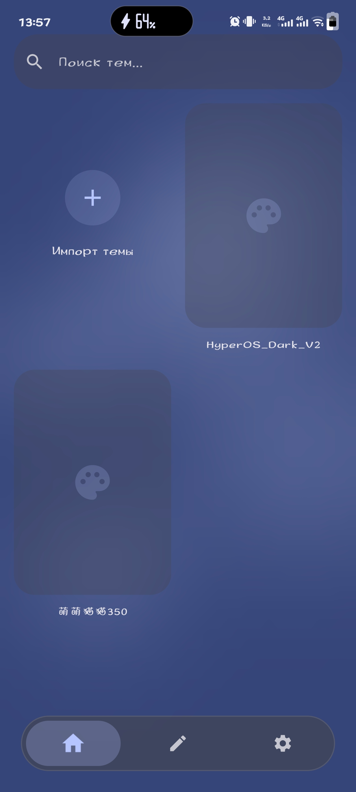
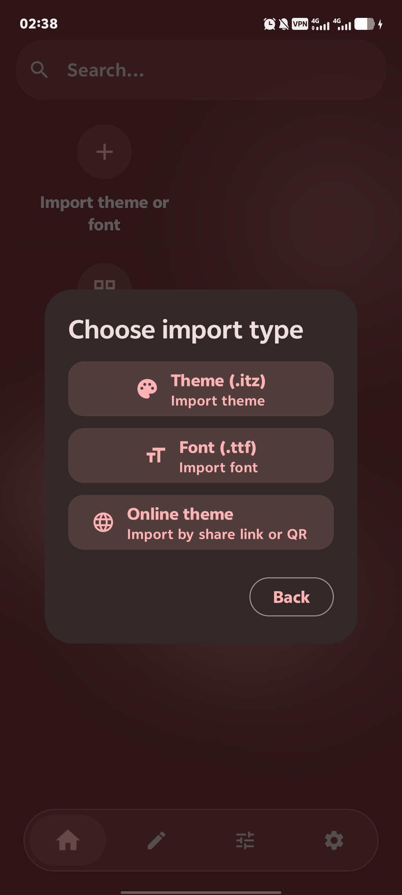
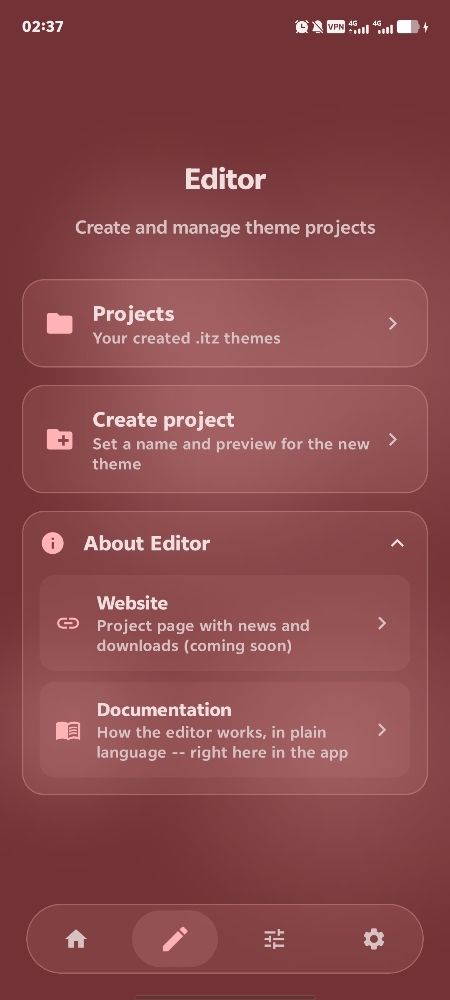
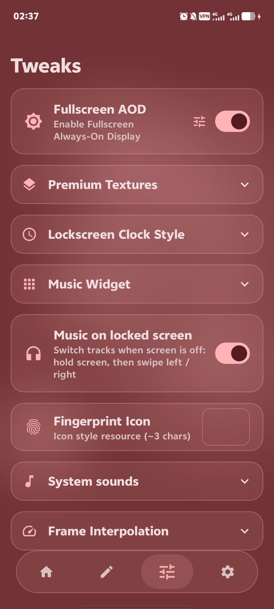
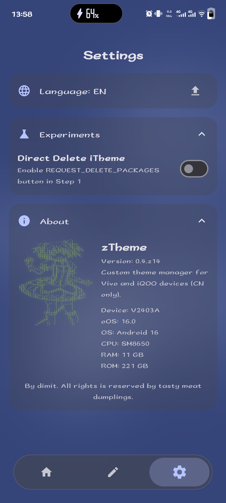

  

  <strong>Advanced Theme Manager for Vivo/iQOO devices.</strong>

zTheme is a powerful and lightweight utility designed to help users install custom `.itz` themes on Vivo and iQOO devices running OriginOS 4/5/6. It simplifies the hard process of importing custom theme by providing guided step-by-step instructions. And theme editor.

### Screenshots

  
  
  
  
  
  
  

### Description
- **Easy Import:** Simply pick an `.itz` file and it will appear in your theme gallery.
- **Guided Installation:** Detailed guide to apply any custom theme.
- **Theme Management:** Share, delete, or locate your theme files easily via the context menu.
- **UI:** Interface built with Jetpack Compose and MD3.

### Not complate\TODO:
- Wiki
- Themes\Fonts AutoInstall
- Merge emojis into font
- Online Theme gallery. (will be based by firebase)
- More converters
- Improve QOL for theme editor

### Localization
Want to see zTheme in your language? We use a simple YAML localization system.
1. Download the [template.yaml](Localization/Template.yaml).
2. Follow the instructions inside the file to translate the strings.
3. Import your finished `<language>.yaml` in app settings and send this file [to me in telegram](https://t.me/dimit993) or make pull-request to make language built-in!

### Where can I get custom themes?
- In some telegram groups
- **[iQOO 13 hype](https://t.me/IQOO13Hype) and [Lover's repo](https://t.me/OriginOS_Themes)**
- **[OOSApps](https://t.me/OOSApps)**
- **[OriginOS Utilities](https://t.me/oosthemes)**
- Also you can search it on bilibili, wechat, pan.quark and etc.
- **[Weazn on bilibili](https://space.bilibili.com/67368617)**
---
### For guys who making custom themes:
I added the "thumbnail.png" into theme-itz root path, if you want make a preview on card - add your thumbnail in your theme.
Also you can make previews and add them to "preview" folder in theme-itz.
